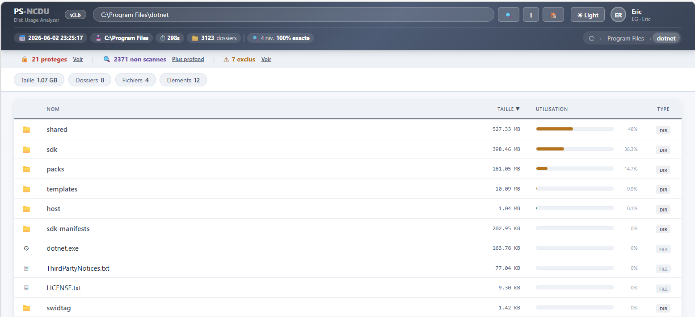

# PS-NCDU

**Analyseur d'espace disque pour Windows, en PowerShell, avec rapport HTML interactif.**

<p align="center">
  
  
  
  
</p>

PS-NCDU est un script PowerShell autonome qui scanne un dossier (ou un disque entier), calcule la taille réelle de chaque sous-dossier et fichier, puis génère un **rapport HTML** moderne, triable et navigable - inspiré de l'outil Unix [`ncdu`](https://dev.yorhel.nl/ncdu), mais pensé pour l'écosystème Windows et sans dépendance externe.

<p align="center">
  
</p>

<p align="center">
  <em>PowerShell&nbsp;5.1+ · Windows · Zéro installation · Rapport HTML standalone</em>
</p>

---

## Sommaire

- [Aperçu](#aperçu)
- [Fonctionnalités](#fonctionnalités)
- [Prérequis](#prérequis)
- [Installation](#installation)
- [Utilisation](#utilisation)
- [Paramètres](#paramètres)
- [Le rapport HTML](#le-rapport-html)
- [Exemples](#exemples)
- [Dépannage](#dépannage)
- [Feuille de route](#feuille-de-route)
- [Contribuer](#contribuer)
- [Licence](#licence)

---

## Aperçu

Lancé sur un chemin, PS-NCDU parcourt l'arborescence de manière récursive, additionne les tailles, repère les dossiers les plus volumineux et produit un fichier `.html` que vous ouvrez dans n'importe quel navigateur. Le rapport est **entièrement autonome** (HTML + CSS + JavaScript en un seul fichier) : aucun serveur, aucune connexion, rien à installer côté client. Vous pouvez l'archiver, l'envoyer par mail ou le déposer sur un partage réseau.

L'objectif : répondre en quelques secondes à la question « **qu'est-ce qui remplit ce disque ?** », avec un rendu lisible et professionnel adapté à un usage en entreprise.

---

## Fonctionnalités

- **Scan récursif** d'un dossier ou d'un disque, avec profondeur configurable.
- **Calcul de taille réelle** par dossier et par fichier, avec total agrégé.
- **Barres de proportion** colorées par paliers de taille (vert → ambre → rouge) pour repérer les gros postes d'un coup d'œil.
- **Tri par taille** et navigation par fil d'Ariane (*breadcrumb*) dans le rapport.
- **Thème clair / sombre** avec bascule en un clic, palette sobre et corporate.
- **Détection des dossiers protégés** (ACL / accès refusé) : affichés explicitement avec le badge `ACL` plutôt qu'ignorés silencieusement, taille marquée `N/A`.
- **Repérage des fichiers volumineux** et indicateur dédié dans la barre de statistiques.
- **Badges de type de fichier** (`.iso`, `.xlsx`, `.txt`, `.md`, …) avec icônes dossier/fichier.
- **Indicateur OneDrive** pour distinguer les contenus synchronisés dans le cloud.
- **Barre de statistiques** : total analysé, nombre d'éléments, nombre d'éléments volumineux, nombre d'éléments protégés.
- **Rapport HTML 100 % autonome** - un seul fichier, ouvrable hors ligne.

---

## Prérequis

| Élément | Détail |
|---|---|
| Système | Windows 10 / 11 ou Windows Server |
| PowerShell | 5.1 (Windows PowerShell) ou 7+ (PowerShell Core) |
| Droits | Lecture sur les dossiers scannés ; certains chemins système exigent une console **administrateur** |
| Navigateur | N'importe quel navigateur récent pour ouvrir le rapport |

Aucun module externe n'est requis.

---

## Installation

Clonez le dépôt ou téléchargez simplement le fichier `.ps1` :

```powershell
git clone https://github.com/Vietnamix/PS-NCDU.git
cd PS-NCDU
```

Le script est encodé en **UTF-8 avec BOM** : ne le réenregistrez pas dans un autre encodage, sous peine de casser l'affichage des accents et des icônes dans le rapport.

> **Politique d'exécution** — Si Windows bloque le lancement des scripts, autorisez l'exécution pour la session courante :
> ```powershell
> Set-ExecutionPolicy -Scope Process -ExecutionPolicy Bypass
> ```
> Cette commande ne modifie rien de façon permanente : elle ne vaut que pour la fenêtre PowerShell ouverte.

---

## Utilisation

Lancement le plus simple, sur le dossier courant :

```powershell
.\PS-NCDU_v3_6.ps1
```

Sur un chemin précis :

```powershell
.\PS-NCDU_v3_6.ps1 -Path "C:\Users\eric"
```

Le script effectue le scan, génère le rapport `.html` et l'ouvre généralement automatiquement dans le navigateur par défaut.

---

## Paramètres

> Les noms ci-dessous décrivent les options du script. Adaptez-les si votre bloc `param()` diffère légèrement.

| Paramètre | Type | Description |
|---|---|---|
| `-Path` | `string` | Dossier ou disque à analyser. Par défaut : le dossier courant. |
| `-Depth` | `int` | Profondeur maximale d'arborescence à parcourir (ex. `3`). |
| `-Output` | `string` | Chemin du fichier HTML généré. Par défaut, à côté du script ou dans le dossier scanné. |
| `-MinSize` | `int` | Seuil (en Mo) à partir duquel un élément est marqué « volumineux ». |
| `-Theme` | `string` | Thème de départ du rapport : `light` ou `dark`. |

Pour afficher l'aide intégrée :

```powershell
Get-Help .\PS-NCDU_v3_6.ps1 -Detailed
```

---

## Le rapport HTML

Le fichier généré contient :

- un **en-tête** avec le chemin analysé, la date, la durée du scan et le nombre de dossiers ;
- une **barre de statistiques** (total, éléments, volumineux, protégés) ;
- un **tableau triable** : icône, nom, taille, barre de proportion (%), type ;
- un **bouton de bascule clair/sombre** en haut à droite ;
- un **pied de page** avec la version, le périmètre du scan et les informations de support.

Les couleurs des barres suivent des paliers de taille pour faire ressortir visuellement les plus gros consommateurs d'espace, et les dossiers inaccessibles (ACL) restent visibles avec un marquage distinct au lieu de disparaître du rapport.

---

## Exemples

Analyser le profil utilisateur complet sur 4 niveaux :

```powershell
.\PS-NCDU_v3_6.ps1 -Path "C:\Users\eric" -Depth 4
```

Analyser un disque entier et enregistrer le rapport sur un partage réseau :

```powershell
.\PS-NCDU_v3_6.ps1 -Path "D:\" -Output "\\serveur\rapports\disque_D.html"
```

Démarrer directement en thème sombre :

```powershell
.\PS-NCDU_v3_6.ps1 -Path "C:\Data" -Theme dark
```

Scanner des chemins système (console administrateur recommandée) :

```powershell
.\PS-NCDU_v3_6.ps1 -Path "C:\Windows" -Depth 2
```

---

## Dépannage

| Symptôme | Cause probable / solution |
|---|---|
| Le script ne se lance pas | Politique d'exécution — voir la note dans [Installation](#installation). |
| Accents ou icônes cassés dans le rapport | Le `.ps1` a été réenregistré sans BOM UTF-8. Restaurez l'encodage d'origine. |
| Beaucoup de dossiers en `ACL` / `N/A` | Droits insuffisants. Relancez PowerShell **en administrateur**. |
| Scan très long sur un gros disque | Réduisez `-Depth` ou ciblez un sous-dossier précis. |
| Le rapport ne s'ouvre pas tout seul | Ouvrez manuellement le fichier `.html` indiqué en fin d'exécution. |

---

## Feuille de route

- [ ] Export complémentaire CSV / JSON des résultats
- [ ] Filtre par type de fichier dans le rapport
- [ ] Comparaison de deux scans (suivi de l'évolution dans le temps)
- [ ] Recherche en direct dans le tableau

*Suggestions bienvenues via les issues.*

---

## Contribuer

Les contributions sont les bienvenues :

1. *Forkez* le dépôt.
2. Créez une branche (`git checkout -b feature/ma-fonctionnalite`).
3. Conservez l'encodage **UTF-8 avec BOM** et les *here-strings* PowerShell intacts.
4. Ouvrez une *pull request* en décrivant clairement le changement.

Pour les bugs et idées, ouvrez une **issue** en précisant version de Windows, version de PowerShell et commande utilisée.

---

## Licence

Distribué sous licence **MIT**. Voir le fichier [`LICENSE.md`](License.md).

---

<p align="center">
  <sub>PS-NCDU · Auteur : Eric Guiffaut · Made with PowerShell 💙</sub>
</p>
