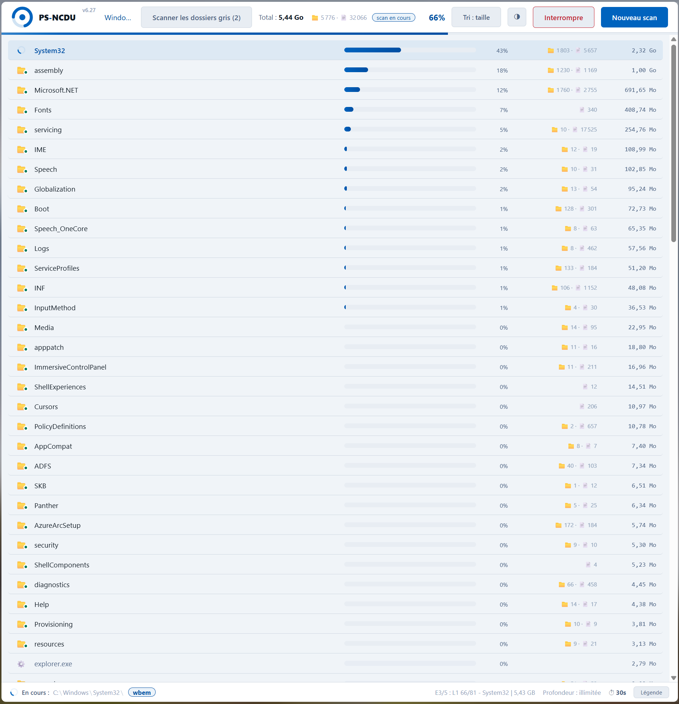
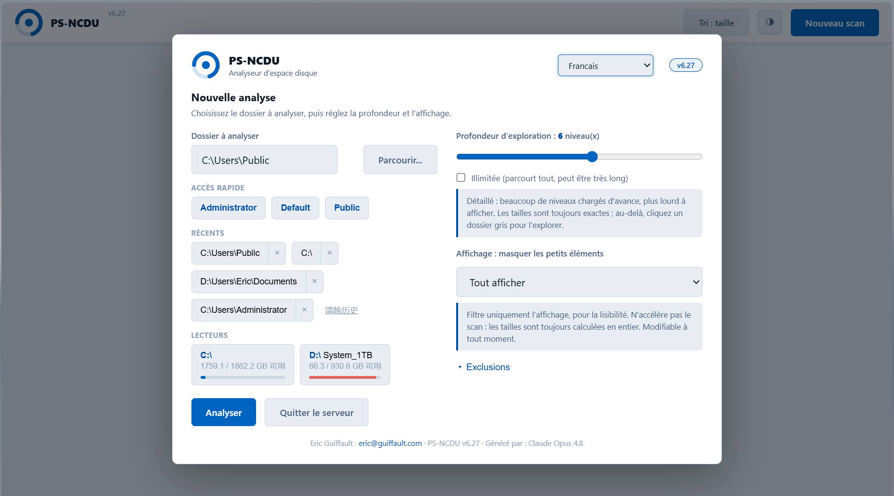

# PS-NCDU

**Analyseur d'espace disque pour Windows, en PowerShell, avec interface web locale et arborescence navigable en temps réel.**

[](https://github.com/Vietnamix/PS-NCDU)
[](https://github.com/Vietnamix/PS-NCDU)
[](https://github.com/Vietnamix/PS-NCDU)
[](License.md)

PS-NCDU est un script PowerShell **mono-fichier et autonome** qui répond en quelques secondes à la question « qu'est-ce qui remplit ce disque ? ». Lancé sans aucun paramètre, il démarre un petit serveur web local, ouvre votre navigateur, et vous laisse choisir un dossier ou un disque à analyser. L'arborescence se construit **en direct** pendant le scan, les tailles se remplissent dossier par dossier, et vous naviguez librement, même avant la fin. Inspiré de l'outil Unix [`ncdu`](https://dev.yorhel.nl/ncdu), pensé pour l'écosystème Windows, sans aucune dépendance externe.



*PowerShell 5.1+ · Windows · Zéro installation · Un seul fichier · 42 langues*

> **Note sur la capture** : l'image ci-dessus provient d'une version antérieure. L'interface actuelle (application web locale, arbre en temps réel) diffère sensiblement ; une capture à jour est prévue.

---

## Sommaire

- [Aperçu](#aperçu)
- [Fonctionnalités](#fonctionnalités)
- [Prérequis](#prérequis)
- [Installation](#installation)
- [Utilisation](#utilisation)
- [L'interface](#linterface)
- [Fonctionnement du scan](#fonctionnement-du-scan)
- [Fichiers de travail](#fichiers-de-travail)
- [Dépannage](#dépannage)
- [Feuille de route](#feuille-de-route)
- [Contribuer](#contribuer)
- [Licence](#licence)

---

## Aperçu

Contrairement aux versions 3.x qui produisaient un rapport HTML statique à ouvrir après coup, PS-NCDU est désormais une **application web locale**. Le script démarre un serveur HTTP sur `127.0.0.1` (port 8787, avec repli automatique sur un port libre), protégé par un jeton de session, et ouvre l'interface dans votre navigateur par défaut. Tout se règle dans cette interface : le dossier à analyser, la profondeur, le filtre d'affichage, les exclusions, la langue.

Le serveur reste sur la machine locale, ne s'expose pas sur le réseau, et s'arrête avec `Ctrl+C` dans la console ou le bouton « Quitter le serveur » dans l'interface.



---

## Fonctionnalités

### Scan et navigation
- **Arborescence en temps réel** : la structure apparaît pendant l'énumération, les tailles arrivent dossier par dossier au fur et à mesure du calcul.
- **Navigation libre pendant le scan** : cliquez un dossier pour y entrer, le fil d'Ariane pour remonter, sans attendre la fin.
- **Profondeur réglable ou illimitée** : quelques niveaux préchargés pour un affichage fluide, ou l'arborescence complète. Les tailles sont toujours exactes, quelle que soit la profondeur ; les niveaux non préchargés se chargent d'un clic.
- **Scan illimité entrelacé** : en profondeur illimitée, chaque sous-arbre est énuméré juste avant d'être mesuré, si bien que les tailles s'affichent dès les premières secondes au lieu d'attendre le parcours de tout le disque.
- **Interruption** : un bouton « Interrompre » stoppe le scan en cours et rend la main ; lancer un nouveau scan coupe automatiquement l'ancien.
- **Dossiers gris cliquables** : exclus, jonctions, protégés (ACL) ou non préchargés restent visibles et se scannent à la demande, avec une file d'attente si un scan tourne déjà.
- **Ordre de traitement aligné sur l'affichage** : la progression se remplit de haut en bas, sans sauts.

### Lecture des résultats
- **Tri Nom / Taille** : par taille par défaut (les plus gros en haut), lissé pendant le scan pour que les lignes ne sautent pas ; un clic bascule vers le tri par nom.
- **Barres de proportion** et pourcentages par rapport au dossier courant.
- **Compteurs** de sous-dossiers et de fichiers, récursifs, par dossier.
- **Fichiers listés à la demande** quand vous ouvrez un dossier, triés par taille, limités aux 1000 plus gros.
- **Icônes par type de fichier** : environ 120 extensions courantes (images, vidéo, audio, PDF, bureautique, archives, code, exécutables, polices, images disque, bases de données, ebooks, certificats, raccourcis) pour identifier les types d'un coup d'œil.
- **Filtre d'affichage** : masquer les éléments sous 1 Mo, 100 Mo ou 1 Go, pour la lisibilité, sans modifier le scan.
- **Points d'état colorés** : scanné, prévu, en file, en cours, gris ; une légende et une aide intégrées expliquent chaque état.
- **Thème clair / sombre**.

### Fenêtre d'analyse
- **Explorateur de dossiers intégré** : lecteurs, navigation par clic, dossier parent, « Choisir ce dossier ». Aucune dépendance au sélecteur natif de Windows, donc fiable même en accès distant.
- **Accès rapides** vers les profils utilisateurs, **récents** avec retrait individuel et effacement, **lecteurs** avec barre d'occupation.
- **Validation du chemin** en direct et au lancement.
- **Exclusions** : liste des dossiers système toujours ignorés, plus un champ pour en exclure d'autres le temps d'un scan.
- **Réglages mémorisés** (chemin, profondeur, filtre, tri, langue) d'une session à l'autre.
- **Entrée** pour lancer, **Échap** ou croix pour refermer la fenêtre quand un scan est déjà affiché.

### Langues
- **42 langues**, couvrant plus de 80 % de la population mondiale : anglais, chinois, hindi, espagnol, français, arabe, bengali, portugais, russe, ourdou, indonésien, allemand, japonais, coréen, italien, turc, vietnamien, polonais, néerlandais, ukrainien, roumain, tchèque, grec, suédois, hongrois, persan, thaï, malais, philippin, swahili, tamoul, télougou, marathi, gujarati, kannada, malayalam, pendjabi, hébreu, haoussa, birman, amharique, khmer.
- Détection automatique de la langue du système, sélecteur dans la fenêtre d'analyse, choix mémorisé.
- Sens d'écriture de droite à gauche pour l'arabe, l'ourdou, le persan et l'hébreu.
- Les traductions des 30 langues les plus récentes sont au meilleur effort ; une relecture par des locuteurs natifs est bienvenue, en particulier pour l'amharique, le khmer, le birman, le haoussa et les langues indiennes. Quelques longs paragraphes d'aide retombent encore sur l'anglais dans ces langues.

---

## Prérequis

| Élément    | Détail                                                                                                                      |
| ---------- | --------------------------------------------------------------------------------------------------------------------------- |
| Système    | Windows 10 / 11 ou Windows Server                                                                                           |
| PowerShell | 5.1 (Windows PowerShell) ou 7+ (PowerShell Core)                                                                            |
| Mode       | **FullLanguage** requis (le serveur web s'appuie sur `HttpListener`). Voir [Dépannage](#dépannage) en cas de mode contraint. |
| Droits     | Lecture sur les dossiers scannés ; certains chemins système exigent une console **administrateur**                          |
| Navigateur | N'importe quel navigateur récent                                                                                            |

Aucun module externe n'est requis.

---

## Installation

Clonez le dépôt ou téléchargez simplement le fichier `ps-ncdu.ps1` :

```powershell
git clone https://github.com/Vietnamix/PS-NCDU.git
cd PS-NCDU
```

Le script est encodé en **UTF-8 avec BOM**. Ne le réenregistrez pas dans un autre encodage : PowerShell 5.1 lirait alors le fichier en ANSI et casserait les accents et les langues non latines de l'interface.

> **Politique d'exécution** : si Windows bloque le lancement des scripts, autorisez l'exécution pour la session courante :
>
> ```powershell
> Set-ExecutionPolicy -Scope Process -ExecutionPolicy Bypass
> ```
>
> Cette commande ne modifie rien de façon permanente : elle ne vaut que pour la fenêtre PowerShell ouverte.

---

## Utilisation

Il n'y a **aucun paramètre en ligne de commande**. Lancez simplement le script :

```powershell
.\ps-ncdu.ps1
```

Le script :

1. démarre le serveur local et affiche son adresse dans la console (par exemple `http://127.0.0.1:8787/?token=...`) ;
2. ouvre cette adresse dans votre navigateur par défaut ;
3. présente la fenêtre d'analyse, où vous choisissez le dossier, la profondeur et l'affichage, puis cliquez « Analyser ».

Si le navigateur ne s'ouvre pas de lui-même, copiez l'adresse affichée dans la console. Pour arrêter : `Ctrl+C` dans la console, ou le bouton « Quitter le serveur » dans l'interface.

Pour scanner des chemins système (`C:\Windows`, la racine d'un disque), lancez la console **en administrateur** : les dossiers protégés apparaîtront sinon en gris.

---

## L'interface

- **En-tête** : fil d'Ariane, total du dossier courant avec compteurs, pourcentage d'avancement, bouton de tri Nom / Taille, thème, « Interrompre » pendant un scan, « Nouveau scan ».
- **Arbre** : une ligne par dossier ou fichier, avec point d'état, icône de type, nom, barre de proportion, pourcentage, compteurs et taille. Les dossiers gris se scannent d'un clic ; un bouton « Scanner les dossiers gris (N) » traite tous ceux du dossier courant.
- **Pied de page** : étape en cours, chemin réellement lu à l'instant, profondeur du scan, chronomètre, et le panneau Légende / Aide.
- **Fenêtre d'analyse** (« Nouveau scan ») : en deux colonnes. À gauche la destination (chemin, explorateur intégré, accès rapides, récents, lecteurs). À droite les options (profondeur avec réglette et mode illimité, filtre d'affichage, exclusions). Le sélecteur de langue est dans l'en-tête de cette fenêtre.

---

## Fonctionnement du scan

Le moteur travaille en étapes. Une **énumération** découvre la structure et l'émet vers l'arbre au fil de l'eau ; un **calcul des tailles** parcourt ensuite chaque sous-arbre de premier niveau, dans l'ordre d'affichage, en remontant les tailles partielles à tous les ancêtres une fois par seconde. Les événements circulent du serveur vers la page par flux SSE.

Quelques choix de conception à connaître :

- **Un seul scan à la fois**, volontairement : deux scans disque en parallèle se ralentiraient mutuellement. Les demandes supplémentaires (dossiers gris) sont mises en file et traitées à la fin.
- **Serveur mono-thread** : l'interruption est coopérative. Fermer la connexion (bouton « Interrompre », ou nouveau scan) fait échouer la prochaine écriture du serveur, qui lève un drapeau vérifié dans les boucles ; l'arrêt effectif prend jusqu'à une seconde.
- **Jonctions et points de réanalyse** sont ignorés pour éviter les boucles et les doubles comptes.
- **Lecteurs réseau** : leur espace n'est pas interrogé au démarrage, ce qui évite un blocage quand un lecteur mappé est injoignable (VPN coupé, par exemple).
- **Énumération .NET en flux** (`EnumerateFiles` / `EnumerateDirectories`) plutôt que `Get-ChildItem`, nettement plus rapide en PowerShell 5.1. Le plafond de performance reste celui d'un script interprété : les outils natifs qui lisent la MFT NTFS directement restent bien plus rapides, c'est assumé.

---

## Fichiers de travail

| Emplacement                          | Rôle                                        |
| ------------------------------------ | ------------------------------------------- |
| `%TEMP%\psncdu\psncdu_debug.log`     | Journal détaillé du serveur et des scans    |
| `%TEMP%\psncdu\history.txt`          | Historique des chemins scannés (« Récents ») |

Dossiers système toujours exclus du scan : `C:\Windows\WinSxS`, `C:\Windows\Installer`, `C:\$Recycle.Bin`, `C:\System Volume Information`, `C:\Recovery`, `C:\ProgramData\Microsoft\Windows Defender`, `C:\Windows\SoftwareDistribution`. Vous pouvez en ajouter d'autres, le temps d'un scan, depuis la section Exclusions de la fenêtre d'analyse.

---

## Dépannage

| Symptôme                                                  | Cause probable / solution                                                                                                                       |
| --------------------------------------------------------- | ----------------------------------------------------------------------------------------------------------------------------------------------- |
| Le script ne se lance pas                                 | Politique d'exécution, voir la note dans [Installation](#installation).                                                                         |
| « Le serveur web exige le mode FullLanguage »             | La session est en ConstrainedLanguage (stratégie AppLocker / WDAC). Lancez depuis une console non contrainte, ou utilisez la version 3.2 (rapport HTML statique), qui fonctionne en mode contraint. |
| Accents ou langues non latines cassés dans l'interface    | Le `.ps1` a été réenregistré sans BOM UTF-8. Restaurez l'encodage d'origine.                                                                     |
| Beaucoup de dossiers gris « protégé »                     | Droits insuffisants. Relancez PowerShell **en administrateur**.                                                                                 |
| Le navigateur ne s'ouvre pas                              | Ouvrez manuellement l'adresse affichée dans la console (avec son jeton).                                                                        |
| Page vide ou serveur figé au démarrage                    | Vérifiez le journal `%TEMP%\psncdu\psncdu_debug.log`. Un lecteur réseau injoignable pouvait bloquer les anciennes versions ; corrigé depuis la 5.14. |
| Rien ne se passe pendant un scan illimité sur un disque   | Corrigé depuis la 6.17 (énumération entrelacée). Si cela persiste, vérifiez la version affichée dans l'en-tête.                                  |
| Un libellé reste en anglais dans une autre langue         | Pour les 30 langues les plus récentes, quelques longs textes d'aide retombent volontairement sur l'anglais. Les contributions de traduction sont bienvenues. |

---

## Feuille de route

- [ ] Capture d'écran à jour de l'interface v6
- [ ] Traduction des longs paragraphes d'aide restants pour les 30 langues récentes, idéalement par des locuteurs natifs
- [ ] Barre de progression ancrée sur l'espace réellement occupé du disque, plutôt que sur des tranches d'étapes
- [ ] Indicateurs de débit pendant le scan (fichiers par seconde, Mo par seconde)
- [ ] Export CSV / JSON des résultats
- [ ] Comparaison de deux scans dans le temps

*Suggestions bienvenues via les issues.*

---

## Contribuer

Les contributions sont les bienvenues :

1. *Forkez* le dépôt.
2. Créez une branche (`git checkout -b feature/ma-fonctionnalite`).
3. Conservez l'encodage **UTF-8 avec BOM** et les *here-strings* PowerShell intacts.
4. Pour les traductions, chaque langue est un objet du dictionnaire `I18N` dans le script ; comparez ses clés à celles de `en` pour repérer ce qui manque.
5. Ouvrez une *pull request* en décrivant clairement le changement.

Pour les bugs et idées, ouvrez une **issue** en précisant version de Windows, version de PowerShell, version de PS-NCDU affichée dans l'en-tête, et si possible un extrait du journal `%TEMP%\psncdu\psncdu_debug.log`.

---

## Licence

Distribué sous licence **MIT**. Voir le fichier [`License.md`](License.md).

---

## Auteur

**[Eric Guiffault](https://eric.guiffault.com)**

Si ce projet vous est utile, pensez à me laisser une étoile sur GitHub.
