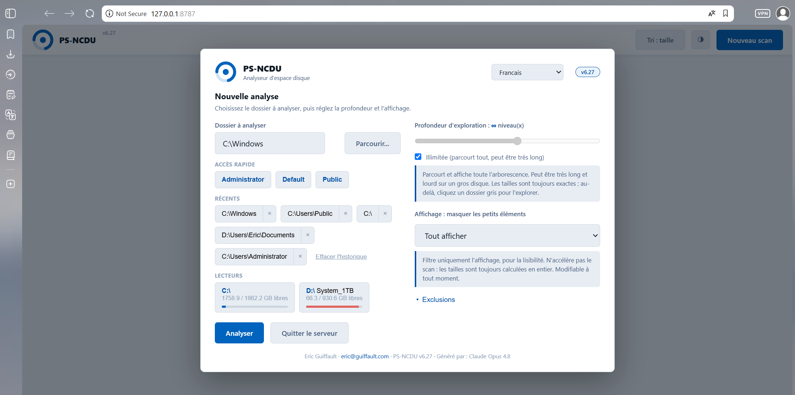

# PS-NCDU

**Disk usage analyzer for Windows, in PowerShell, with a local web interface and a live, navigable tree.**

[](https://github.com/Vietnamix/PS-NCDU)
[](https://github.com/Vietnamix/PS-NCDU)
[](https://github.com/Vietnamix/PS-NCDU)
[](License.md)

PS-NCDU is a **single-file, self-contained** PowerShell script that answers "what is filling up this disk?" in seconds. Run it with no parameters: it starts a small local web server, opens your browser, and lets you pick a folder or a drive to analyze. The tree builds **live** while the scan runs, sizes fill in folder by folder, and you can navigate freely before it finishes. Inspired by the Unix tool [`ncdu`](https://dev.yorhel.nl/ncdu), built for the Windows ecosystem, with no external dependency.


*PowerShell 5.1+ · Windows · Zero install · Single file · 42 languages*

Other languages: [Français](README.md) · [中文](/Translation/README_ZH.md) · [हिन्दी](/Translation/README_HI.md) · [Español](README_ES.md) · [العربية](README_AR.md) · [বাংলা](README_BN.md) · [Português](README_PT.md) · [Русский](README_RU.md) · [اردو](README_UR.md) · [Bahasa Indonesia](README_ID.md) · [Deutsch](README_DE.md) · [日本語](README_JA.md) · [Türkçe](README_TR.md) · [Tiếng Việt](README_VI.md) · [한국어](README_KO.md) · [Italiano](README_IT.md)

---

## Contents

- [Overview](#overview)
- [Features](#features)
- [Requirements](#requirements)
- [Installation](#installation)
- [Usage](#usage)
- [The interface](#the-interface)
- [How the scan works](#how-the-scan-works)
- [Working files](#working-files)
- [Troubleshooting](#troubleshooting)
- [Roadmap](#roadmap)
- [Contributing](#contributing)
- [License](#license)

---

## Overview

Unlike the 3.x versions, which produced a static HTML report to open afterwards, PS-NCDU is now a **local web application**. The script starts an HTTP server on `127.0.0.1` (port 8787, with automatic fallback to a free port), protected by a session token, and opens the interface in your default browser. Everything is set from that interface: the folder to analyze, the depth, the display filter, the exclusions, the language.

The server stays on the local machine, is not exposed on the network, and stops with `Ctrl+C` in the console or the "Quit server" button in the interface.



---

## Features

### Scanning and navigation
- **Live tree**: the structure appears during enumeration, and sizes arrive folder by folder as they are computed.
- **Free navigation during the scan**: click a folder to enter it, use the breadcrumb to go up, without waiting for the end.
- **Adjustable or unlimited depth**: preload a few levels for a fluid display, or the whole tree. Sizes are always exact whatever the depth; levels that are not preloaded load with one click.
- **Interleaved unlimited scan**: in unlimited depth, each subtree is enumerated right before it is measured, so sizes show up within seconds instead of waiting for the whole disk to be walked.
- **Interruption**: a "Stop" button halts the current scan and hands control back; starting a new scan automatically cancels the previous one.
- **Clickable grey folders**: excluded, junctions, protected (ACL) or not-yet-preloaded folders stay visible and scan on demand, with a queue if a scan is already running.
- **Processing order aligned with the display**: progress fills from top to bottom, with no jumping.

### Reading the results
- **Name / Size sort**: by size by default (largest on top), smoothed during the scan so rows do not jump around; one click switches to sorting by name.
- **Proportion bars** and percentages relative to the current folder.
- **Recursive counters** of subfolders and files per folder.
- **Files listed on demand** when you open a folder, sorted by size, capped at the 1000 largest.
- **File-type icons**: around 120 common extensions (images, video, audio, PDF, office documents, archives, code, executables, fonts, disk images, databases, ebooks, certificates, shortcuts) to identify types at a glance.
- **Display filter**: hide items under 1 MB, 100 MB or 1 GB for readability, without changing the scan.
- **Colored status dots**: scanned, planned, queued, in progress, grey; a built-in legend and help explain each state.
- **Light / dark theme**.

### Analysis window
- **Built-in folder browser**: drives, click navigation, parent folder, "Choose this folder". No reliance on the native Windows picker, so it works reliably even over remote access.
- **Quick access** to user profiles, **recents** with individual removal and clear-all, **drives** with a usage bar.
- **Path validation** live and at launch.
- **Exclusions**: the list of system folders always skipped, plus a field to exclude more for the duration of a scan.
- **Remembered settings** (path, depth, filter, sort, language) across sessions.
- **Enter** to launch, **Escape** or the close button to dismiss the window when a scan is already displayed.

### Languages
- **42 languages**, covering more than 80% of the world's population: English, Chinese, Hindi, Spanish, French, Arabic, Bengali, Portuguese, Russian, Urdu, Indonesian, German, Japanese, Korean, Italian, Turkish, Vietnamese, Polish, Dutch, Ukrainian, Romanian, Czech, Greek, Swedish, Hungarian, Persian, Thai, Malay, Filipino, Swahili, Tamil, Telugu, Marathi, Gujarati, Kannada, Malayalam, Punjabi, Hebrew, Hausa, Burmese, Amharic, Khmer.
- Automatic detection of the system language, a selector in the analysis window, remembered choice.
- Right-to-left writing for Arabic, Urdu, Persian and Hebrew.
- Translations for the 30 most recent languages are best effort; review by native speakers is welcome, especially for Amharic, Khmer, Burmese, Hausa and the Indian languages.

---

## Requirements

| Item       | Detail                                                                                                                       |
| ---------- | ---------------------------------------------------------------------------------------------------------------------------- |
| System     | Windows 10 / 11 or Windows Server                                                                                            |
| PowerShell | 5.1 (Windows PowerShell) or 7+ (PowerShell Core)                                                                             |
| Mode       | **FullLanguage** required (the web server relies on `HttpListener`). See [Troubleshooting](#troubleshooting) for constrained mode. |
| Rights     | Read access to the scanned folders; some system paths require an **administrator** console                                    |
| Browser    | Any recent browser                                                                                                           |

No external module is required.

---

## Installation

Clone the repository or simply download the `ps-ncdu.ps1` file:

```powershell
git clone https://github.com/Vietnamix/PS-NCDU.git
cd PS-NCDU
```

The script is encoded in **UTF-8 with BOM**. Do not re-save it in another encoding: PowerShell 5.1 would then read the file as ANSI and break the accents and non-Latin languages of the interface.

> **Execution policy**: if Windows blocks script execution, allow it for the current session:
>
> ```powershell
> Set-ExecutionPolicy -Scope Process -ExecutionPolicy Bypass
> ```
>
> This changes nothing permanently: it only applies to the open PowerShell window.

---

## Usage

There are **no command-line parameters**. Just run the script:

```powershell
.\ps-ncdu.ps1
```

The script:

1. starts the local server and prints its address in the console (for example `http://127.0.0.1:8787/?token=...`);
2. opens that address in your default browser;
3. shows the analysis window, where you pick the folder, the depth and the display, then click "Analyze".

If the browser does not open by itself, copy the address printed in the console. To stop: `Ctrl+C` in the console, or the "Quit server" button in the interface.

To scan system paths (`C:\Windows`, the root of a drive), run the console **as administrator**: protected folders would otherwise show up in grey.

---

## The interface

- **Header**: breadcrumb, total of the current folder with counters, progress percentage, Name / Size sort button, theme, "Stop" during a scan, "New scan".
- **Tree**: one row per folder or file, with status dot, type icon, name, proportion bar, percentage, counters and size. Grey folders scan with one click; a "Scan grey folders (N)" button handles all of them in the current folder.
- **Footer**: current stage, the path actually being read right now, scan depth, timer, and the Legend / Help panel.
- **Analysis window** ("New scan"): two columns. On the left the destination (path, built-in browser, quick access, recents, drives). On the right the options (depth with a slider and unlimited mode, display filter, exclusions). The language selector sits in this window's header.

---

## How the scan works

The engine works in stages. An **enumeration** discovers the structure and streams it to the tree as it goes; a **size computation** then walks each first-level subtree, in display order, pushing partial sizes up to every ancestor once per second. Events flow from the server to the page over SSE.

A few design choices worth knowing:

- **One scan at a time**, deliberately: two parallel disk scans would slow each other down. Extra requests (grey folders) are queued and processed at the end.
- **Single-threaded server**: interruption is cooperative. Closing the connection ("Stop" button, or a new scan) makes the server's next write fail, which raises a flag checked inside the loops; the actual stop takes up to one second.
- **Junctions and reparse points** are skipped to avoid loops and double counting.
- **Network drives**: their space is not queried at startup, which avoids a hang when a mapped drive is unreachable (VPN down, for instance).
- **Streaming .NET enumeration** (`EnumerateFiles` / `EnumerateDirectories`) rather than `Get-ChildItem`, noticeably faster in PowerShell 5.1. The performance ceiling remains that of an interpreted script: native tools that read the NTFS MFT directly stay much faster, and that is accepted.

---

## Working files

| Location                             | Role                                          |
| ------------------------------------ | --------------------------------------------- |
| `%TEMP%\psncdu\psncdu_debug.log`     | Detailed log of the server and the scans      |
| `%TEMP%\psncdu\history.txt`          | History of scanned paths ("Recents")          |

System folders always excluded from the scan: `C:\Windows\WinSxS`, `C:\Windows\Installer`, `C:\$Recycle.Bin`, `C:\System Volume Information`, `C:\Recovery`, `C:\ProgramData\Microsoft\Windows Defender`, `C:\Windows\SoftwareDistribution`. You can add more, for the duration of a scan, from the Exclusions section of the analysis window.

---

## Troubleshooting

| Symptom                                                   | Likely cause / fix                                                                                                                              |
| --------------------------------------------------------- | ---------------------------------------------------------------------------------------------------------------------------------------------- |
| The script does not start                                 | Execution policy, see the note under [Installation](#installation).                                                                             |
| "The web server requires FullLanguage mode"               | The session is in ConstrainedLanguage (AppLocker / WDAC policy). Run from an unconstrained console, or use version 3.2 (static HTML report), which works in constrained mode. |
| Broken accents or non-Latin languages in the interface    | The `.ps1` was re-saved without the UTF-8 BOM. Restore the original encoding.                                                                    |
| Many grey "protected" folders                             | Insufficient rights. Restart PowerShell **as administrator**.                                                                                   |
| The browser does not open                                 | Open the address printed in the console manually (with its token).                                                                              |
| Blank page or frozen server at startup                    | Check the log at `%TEMP%\psncdu\psncdu_debug.log`. An unreachable network drive could hang older versions; fixed since 5.14.                     |
| Nothing happens during an unlimited scan of a drive       | Fixed since 6.17 (interleaved enumeration). If it persists, check the version shown in the header.                                              |

---

## Roadmap

- [ ] Review of the 30 recent languages' translations by native speakers
- [ ] Progress bar anchored on the disk's actual used space rather than on stage brackets
- [ ] Throughput indicators during the scan (files per second, MB per second)
- [ ] CSV / JSON export of the results
- [ ] Comparison of two scans over time

*Suggestions welcome through issues.*

---

## Contributing

Contributions are welcome:

1. *Fork* the repository.
2. Create a branch (`git checkout -b feature/my-feature`).
3. Keep the **UTF-8 with BOM** encoding and the PowerShell *here-strings* intact.
4. For translations, each language is an object in the `I18N` dictionary inside the script; compare its keys with those of `en` to spot what is missing.
5. Open a *pull request* describing the change clearly.

For bugs and ideas, open an **issue** stating the Windows version, the PowerShell version, the PS-NCDU version shown in the header, and if possible an excerpt of the log at `%TEMP%\psncdu\psncdu_debug.log`.

---

## License

Distributed under the **MIT** license. See the [`License.md`](License.md) file.

---

## Author

**[Eric Guiffault](https://eric.guiffault.com)**

If this project is useful to you, consider leaving a star on GitHub.
