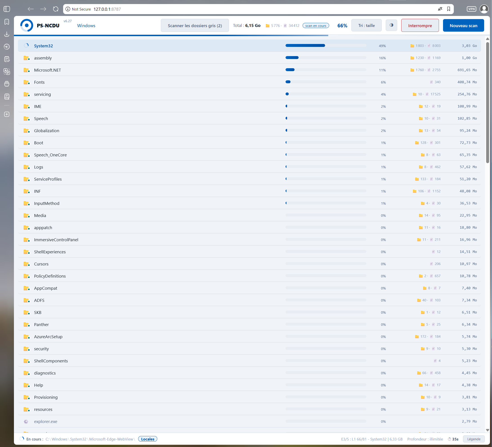
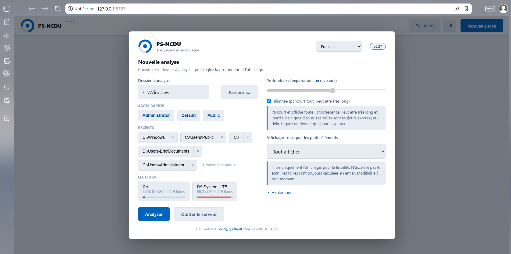

# PS-NCDU

**Windows 向けディスク使用量アナライザー。PowerShell 製で、ローカル Web インターフェースとリアルタイムに操作できるツリー表示を備えています。**

[](https://github.com/Vietnamix/PS-NCDU)
[](https://github.com/Vietnamix/PS-NCDU)
[](https://github.com/Vietnamix/PS-NCDU)
[](License.md)

PS-NCDU は**単一ファイルで自己完結**した PowerShell スクリプトで、「このディスクを埋めているのは何か？」という問いに数秒で答えます。パラメーターなしで実行すると、小さなローカル Web サーバーを起動し、ブラウザーを開き、分析するフォルダーまたはドライブを選ばせてくれます。ツリーはスキャン中に**リアルタイム**で構築され、サイズはフォルダーごとに埋まっていき、完了前でも自由に移動できます。Unix ツール [`ncdu`](https://dev.yorhel.nl/ncdu) に着想を得て、Windows エコシステム向けに設計され、外部依存はありません。



*PowerShell 5.1+ · Windows · インストール不要 · 単一ファイル · 42 言語*

他の言語：[Français](README.md) · [English](README_EN.md) · [中文](README_ZH.md) · [हिन्दी](README_HI.md) · [Español](README_ES.md) · [العربية](README_AR.md) · [বাংলা](README_BN.md) · [Português](README_PT.md) · [Русский](README_RU.md) · [اردو](README_UR.md) · [Bahasa Indonesia](README_ID.md) · [Deutsch](README_DE.md) · [Türkçe](README_TR.md) · [Tiếng Việt](README_VI.md) · [한국어](README_KO.md) · [Italiano](README_IT.md)

---

## 目次

- [概要](#概要)
- [機能](#機能)
- [動作要件](#動作要件)
- [インストール](#インストール)
- [使い方](#使い方)
- [インターフェース](#インターフェース)
- [スキャンの仕組み](#スキャンの仕組み)
- [作業ファイル](#作業ファイル)
- [トラブルシューティング](#トラブルシューティング)
- [ロードマップ](#ロードマップ)
- [貢献](#貢献)
- [ライセンス](#ライセンス)

---

## 概要

後から開く静的 HTML レポートを生成していた 3.x 系とは異なり、PS-NCDU は現在**ローカル Web アプリケーション**です。スクリプトは `127.0.0.1` 上に HTTP サーバーを起動し（ポート 8787、使用中なら空きポートへ自動フォールバック）、セッショントークンで保護され、既定のブラウザーでインターフェースを開きます。すべての設定はこのインターフェースで行います：分析するフォルダー、深さ、表示フィルター、除外、言語。

サーバーはローカルマシン上にとどまり、ネットワークには公開されず、コンソールで `Ctrl+C` を押すか、インターフェースの「サーバーを終了」ボタンで停止します。



---

## 機能

### スキャンと移動
- **リアルタイムツリー**：列挙中に構造が現れ、サイズは計算されるとフォルダーごとに到着します。
- **スキャン中の自由な移動**：フォルダーをクリックして入り、パンくずで上へ戻れます。終了を待つ必要はありません。
- **調整可能または無制限の深さ**：数階層だけ先読みして軽快に表示するか、ツリー全体を読み込むか。深さに関わらずサイズは常に正確で、先読みされていない階層はワンクリックで読み込まれます。
- **インターリーブ式の無制限スキャン**：無制限の深さでは、各サブツリーは計測の直前に列挙されるため、ディスク全体の走査を待たずに最初の数秒でサイズが表示されます。
- **中断**：「中断」ボタンで現在のスキャンを止めて操作に戻れます。新しいスキャンを開始すると前のスキャンは自動的に取り消されます。
- **クリックできるグレーのフォルダー**：除外、ジャンクション、保護（ACL）、または未先読みのフォルダーは表示されたままで、必要に応じてスキャンできます。スキャン実行中なら待機列に入ります。
- **処理順序が表示と一致**：進捗は上から下へ順に埋まり、飛び跳ねません。

### 結果の見方
- **名前 / サイズの並べ替え**：既定はサイズ順（大きいものが上）で、スキャン中は行が跳ねないよう平滑化されます。ワンクリックで名前順に切り替え。
- **割合バー**と、現在のフォルダーに対する百分率。
- フォルダーごとのサブフォルダー数とファイル数の**再帰カウント**。
- **必要時にファイルを一覧**：フォルダーを開くと表示され、サイズ順、最大 1000 件まで。
- **ファイル種別アイコン**：約 120 の一般的な拡張子（画像、動画、音声、PDF、オフィス文書、アーカイブ、コード、実行ファイル、フォント、ディスクイメージ、データベース、電子書籍、証明書、ショートカット）で種類を一目で識別。
- **表示フィルター**：1 MB、100 MB、または 1 GB 未満の項目を隠して読みやすくします。スキャン自体は変わりません。
- **色付きステータス点**：スキャン済み、予定、待機中、実行中、グレー。組み込みの凡例とヘルプが各状態を説明します。
- **ライト / ダークテーマ**。

### 分析ウィンドウ
- **組み込みフォルダーブラウザー**：ドライブ、クリック操作、親フォルダー、「このフォルダーを選択」。Windows ネイティブのダイアログに依存しないため、リモートアクセスでも確実に動作します。
- ユーザープロファイルへの**クイックアクセス**、個別削除と全消去に対応した**最近**、使用率バー付きの**ドライブ**。
- **パスの検証**を入力時と起動時に実施。
- **除外**：常にスキップされるシステムフォルダーの一覧と、スキャン中だけ追加で除外するための入力欄。
- **設定の記憶**（パス、深さ、フィルター、並べ替え、言語）をセッション間で保持。
- **Enter** で開始、スキャンが表示済みなら **Esc** または閉じるボタンでウィンドウを閉じます。

### 言語
- **42 言語**、世界人口の 80% 以上をカバー：英語、中国語、ヒンディー語、スペイン語、フランス語、アラビア語、ベンガル語、ポルトガル語、ロシア語、ウルドゥー語、インドネシア語、ドイツ語、日本語、韓国語、イタリア語、トルコ語、ベトナム語、ポーランド語、オランダ語、ウクライナ語、ルーマニア語、チェコ語、ギリシャ語、スウェーデン語、ハンガリー語、ペルシャ語、タイ語、マレー語、フィリピン語、スワヒリ語、タミル語、テルグ語、マラーティー語、グジャラート語、カンナダ語、マラヤーラム語、パンジャーブ語、ヘブライ語、ハウサ語、ビルマ語、アムハラ語、クメール語。
- システム言語の自動検出、分析ウィンドウ内のセレクター、選択の記憶。
- アラビア語、ウルドゥー語、ペルシャ語、ヘブライ語は右から左へ表示。
- 直近に追加された 30 言語の翻訳はベストエフォートです。特にアムハラ語、クメール語、ビルマ語、ハウサ語、インド諸語について、ネイティブによる校閲を歓迎します。

---

## 動作要件

| 項目       | 詳細                                                                                                                                 |
| ---------- | ------------------------------------------------------------------------------------------------------------------------------------ |
| システム   | Windows 10 / 11 または Windows Server                                                                                                |
| PowerShell | 5.1（Windows PowerShell）または 7+（PowerShell Core）                                                                                |
| モード     | **FullLanguage** が必須（Web サーバーは `HttpListener` に依存）。制約付きモードについては[トラブルシューティング](#トラブルシューティング)を参照。 |
| 権限       | スキャン対象フォルダーの読み取り権限。一部のシステムパスは**管理者**コンソールが必要                                                  |
| ブラウザー | 最近のブラウザーであれば何でも可                                                                                                     |

外部モジュールは不要です。

---

## インストール

リポジトリをクローンするか、`ps-ncdu.ps1` ファイルを直接ダウンロードします：

```powershell
git clone https://github.com/Vietnamix/PS-NCDU.git
cd PS-NCDU
```

スクリプトは **BOM 付き UTF-8** でエンコードされています。別のエンコードで保存し直さないでください。PowerShell 5.1 がファイルを ANSI として読み込み、インターフェースのアクセント文字や非ラテン文字の言語が壊れます。

> **実行ポリシー**：Windows がスクリプトの実行をブロックする場合、現在のセッションだけ許可します：
>
> ```powershell
> Set-ExecutionPolicy -Scope Process -ExecutionPolicy Bypass
> ```
>
> このコマンドは恒久的な変更を一切行いません。開いている PowerShell ウィンドウにのみ有効です。

---

## 使い方

**コマンドライン引数はありません**。スクリプトを実行するだけです：

```powershell
.\ps-ncdu.ps1
```

スクリプトは次のように動作します：

1. ローカルサーバーを起動し、そのアドレスをコンソールに表示（例：`http://127.0.0.1:8787/?token=...`）；
2. そのアドレスを既定のブラウザーで開く；
3. 分析ウィンドウを表示。フォルダー、深さ、表示を選んで「分析」をクリック。

ブラウザーが自動で開かない場合は、コンソールに表示されたアドレスをコピーしてください。停止するには、コンソールで `Ctrl+C`、またはインターフェースの「サーバーを終了」ボタンを使います。

システムパス（`C:\Windows`、ドライブのルート）をスキャンするには、コンソールを**管理者として**起動してください。そうしないと保護されたフォルダーはグレーで表示されます。

---

## インターフェース

- **ヘッダー**：パンくず、現在のフォルダーの合計とカウント、進捗率、名前 / サイズの並べ替えボタン、テーマ、スキャン中の「中断」、「新しいスキャン」。
- **ツリー**：フォルダーまたはファイルごとに 1 行。ステータス点、種別アイコン、名前、割合バー、百分率、カウント、サイズを表示。グレーのフォルダーはワンクリックでスキャン。「グレーのフォルダーをスキャン (N)」ボタンで現在のフォルダー内をまとめて処理。
- **フッター**：現在の段階、いま実際に読み込んでいるパス、スキャンの深さ、タイマー、凡例 / ヘルプパネル。
- **分析ウィンドウ**（「新しいスキャン」）：2 列構成。左は対象（パス、組み込みブラウザー、クイックアクセス、最近、ドライブ）。右はオプション（スライダーと無制限モード付きの深さ、表示フィルター、除外）。言語セレクターはこのウィンドウのヘッダーにあります。

---

## スキャンの仕組み

エンジンは段階的に動作します。**列挙**が構造を発見し、逐次ツリーへ送ります。続いて**サイズ計算**が第 1 階層の各サブツリーを表示順に走査し、部分サイズを 1 秒に 1 回すべての祖先へ反映します。イベントは SSE でサーバーからページへ流れます。

知っておくべき設計上の選択：

- **同時に 1 スキャンのみ**、意図的です。並行する 2 つのディスクスキャンは互いを遅くします。追加リクエスト（グレーのフォルダー）は待機列に入り、最後に処理されます。
- **シングルスレッドサーバー**：中断は協調的です。接続を閉じる（「中断」ボタンまたは新しいスキャン）とサーバーの次の書き込みが失敗し、ループ内で確認されるフラグが立ちます。実際の停止には最大 1 秒かかります。
- **ジャンクションと再解析ポイント**はループと二重計上を避けるためスキップされます。
- **ネットワークドライブ**：起動時に空き容量を問い合わせないため、マップされたドライブに到達できない場合（VPN 切断など）のハングを防ぎます。
- **.NET ストリーミング列挙**（`EnumerateFiles` / `EnumerateDirectories`）を `Get-ChildItem` の代わりに使用し、PowerShell 5.1 で大幅に高速。性能の上限はあくまでインタープリター実行のスクリプトのものです。NTFS の MFT を直接読むネイティブツールのほうがはるかに速く、それは承知の上です。

---

## 作業ファイル

| 場所                                 | 役割                                        |
| ------------------------------------ | ------------------------------------------- |
| `%TEMP%\psncdu\psncdu_debug.log`     | サーバーとスキャンの詳細ログ                |
| `%TEMP%\psncdu\history.txt`          | スキャンしたパスの履歴（「最近」）          |

常にスキャンから除外されるシステムフォルダー：`C:\Windows\WinSxS`、`C:\Windows\Installer`、`C:\$Recycle.Bin`、`C:\System Volume Information`、`C:\Recovery`、`C:\ProgramData\Microsoft\Windows Defender`、`C:\Windows\SoftwareDistribution`。分析ウィンドウの「除外」セクションから、スキャン中だけ追加できます。

---

## トラブルシューティング

| 症状                                                      | 考えられる原因 / 対処                                                                                                                            |
| --------------------------------------------------------- | ------------------------------------------------------------------------------------------------------------------------------------------------ |
| スクリプトが起動しない                                    | 実行ポリシー。[インストール](#インストール)の注記を参照。                                                                                        |
| 「Web サーバーには FullLanguage モードが必要です」        | セッションが ConstrainedLanguage（AppLocker / WDAC ポリシー）です。制約のないコンソールから実行するか、制約付きモードで動くバージョン 3.2（静的 HTML レポート）を使用してください。 |
| インターフェースのアクセント文字や非ラテン言語が壊れる    | `.ps1` が UTF-8 BOM なしで保存し直されました。元のエンコードに戻してください。                                                                     |
| グレーの「保護」フォルダーが多い                          | 権限不足です。PowerShell を**管理者として**再起動してください。                                                                                  |
| ブラウザーが開かない                                      | コンソールに表示されたアドレス（トークン付き）を手動で開いてください。                                                                            |
| 起動時にページが空白、またはサーバーが固まる              | ログ `%TEMP%\psncdu\psncdu_debug.log` を確認してください。到達不能なネットワークドライブが旧バージョンをハングさせることがありました。5.14 で修正済み。 |
| ドライブの無制限スキャン中に何も起きない                  | 6.17 で修正済み（インターリーブ列挙）。続く場合はヘッダーに表示されるバージョンを確認してください。                                              |

---

## ロードマップ

- [ ] 直近 30 言語の翻訳をネイティブが校閲
- [ ] 段階ごとの区切りではなく、ディスクの実際の使用量に基づく進捗バー
- [ ] スキャン中のスループット表示（毎秒ファイル数、毎秒 MB）
- [ ] 結果の CSV / JSON エクスポート
- [ ] 2 回のスキャンの経時比較

*提案は issue で歓迎します。*

---

## 貢献

貢献を歓迎します：

1. リポジトリを *fork* する。
2. ブランチを作成する（`git checkout -b feature/my-feature`）。
3. **BOM 付き UTF-8** のエンコードと PowerShell の *here-string* をそのまま保つ。
4. 翻訳については、各言語はスクリプト内の `I18N` 辞書のオブジェクトです。そのキーを `en` のキーと比べれば、不足分が分かります。
5. 変更内容を明確に説明した *pull request* を開く。

バグや提案は、Windows のバージョン、PowerShell のバージョン、ヘッダーに表示される PS-NCDU のバージョン、可能ならログ `%TEMP%\psncdu\psncdu_debug.log` の抜粋を添えて **issue** を開いてください。

---

## ライセンス

**MIT** ライセンスで配布されています。[`License.md`](License.md) ファイルを参照してください。

---

## 作者

**[Eric Guiffault](https://eric.guiffault.com)**

このプロジェクトが役に立ったら、GitHub でスターをお願いします。
